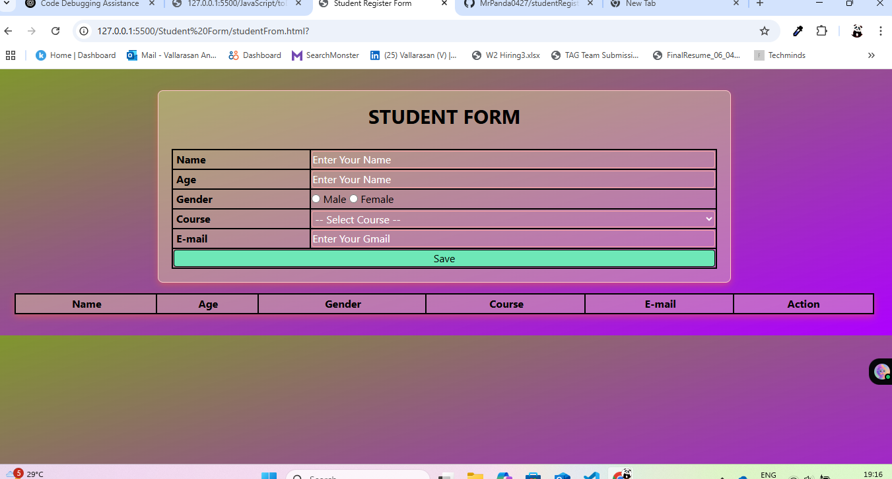

# 📝 Student Register Form

A stylish, responsive student registration form built with **HTML**, **CSS (Tailwind)**, and **JavaScript**, with real-time form validation and data display.

🌐 **Live Demo**: [Click Here](https://mrpanda0427.github.io/studentRegistrationFrom/)

---

## 🎯 Features

- 🔒 Validates form before submission
- 🚫 Prevents submission if any required field is empty or invalid
- 🧮 Accepts: Name, Age, Gender, Course, and Email
- ❌ Rejects empty or invalid inputs
- 📧 Validates email format 
- ✅ Age Validatetion
- 📋 Appends valid entries to a summary table
- 🗑️ Supports one-click row deletion
- 🎨 Transparent inputs with placeholder styling
- 🎨 Beautiful background with maroon-yellow gradient and transparent inputs
- 💫 Clean UI with gradient maroon-yellow background

---

## 🛠️ Technologies Used

- **HTML5**
- **Tailwind CSS** 
- **Vanilla JavaScript**

---

## 📌 Validation Rules

| Field   | Rule |
|---------|------|
| **Name** | Cannot be empty |
| **Age** | Must be a number between 1 and 100 |
| **Gender** | One option (Male/Female) must be selected |
| **Course** | Must choose a course from dropdown |
| **Email** | Must be a valid email and from: `gmail.com`, `yahoo.com`, or `outlook.com` |

---

## 📷 Screenshot

---

## ▶️ How to Use

1. Open the `index.html` file in a browser
2. Fill out the form completely
3. Click `Save`
4. Your data appears below in a styled table
5. Click `Delete` to remove any record

---

## 💡 Note

- Placeholder text is styled in white
- All inputs use transparent backgrounds
- Form has drop-shadow and rounded corners

---

## ✨ Author

Created by **Mr. Panda (Vallarasan Anbu)**

---

